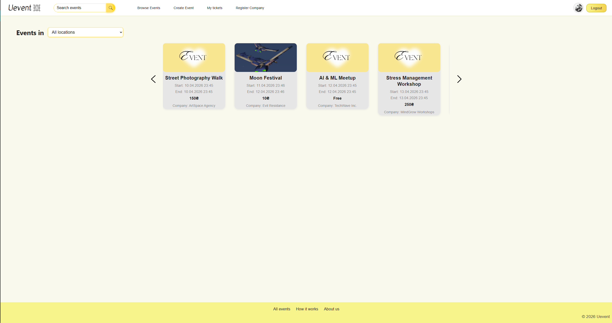
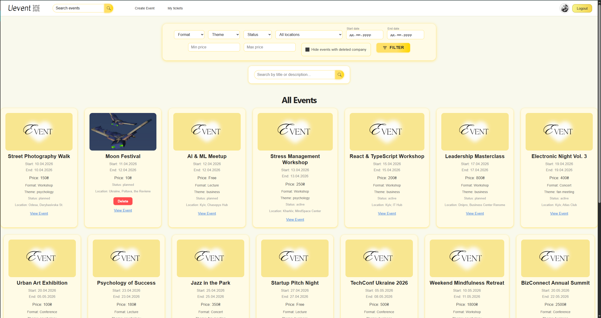
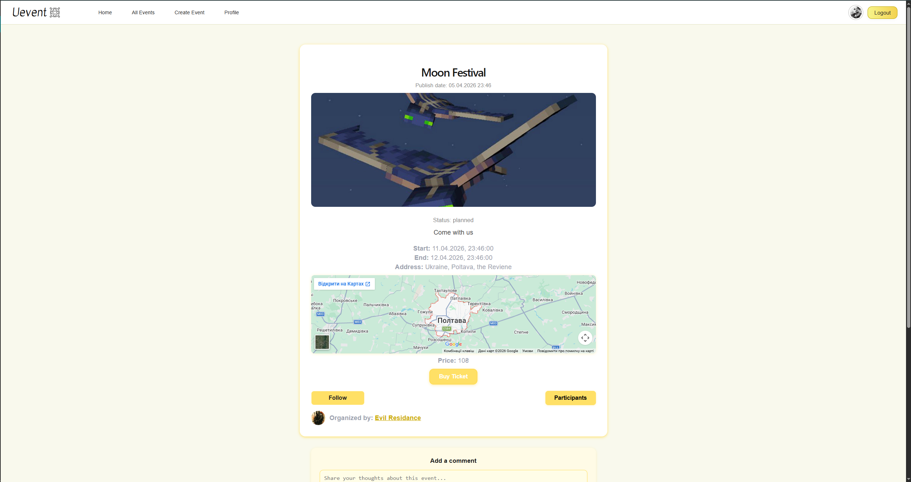
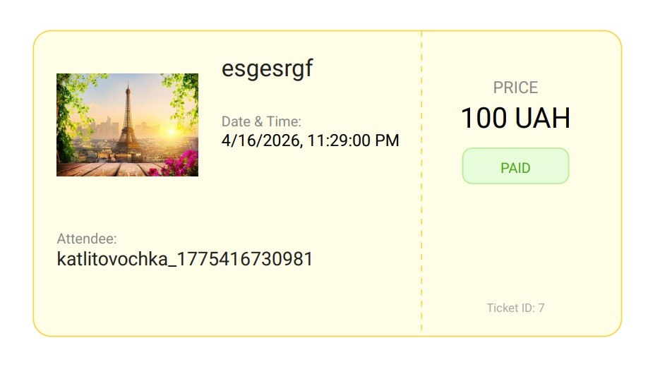

# Uevent

A fullstack platform that connects people through events — find concerts, conferences, workshops and festivals, buy tickets, and meet like-minded new people.

## Table of Contents
 
- [Features](#features)
- [Technical Stack](#technical-stack)
- [Getting Started](#getting-started)
- [Project Structure](#project-structure)
- [Screenshots](#screenshots)
- [API Documentation](#api-documentation)
- [Default Seed Data](#default-seed-data)
- [Authors](#authors)
- [License](#license)

## Features

- **User Authentication** — Registration, login, email confirmation, password reset, Google OAuth
- **Company Profiles** — Register a company and create events on its behalf
- **Event Management** — Create events with posters, promo codes, ticket limits, publish dates
- **Ticket System** — Buy tickets via Stripe, apply promo codes, download PDF tickets
- **Payments** — Stripe integration with fake payment fallback for local development
- **Comments** — Threaded comments (up to 3 levels deep) on event pages
- **Notifications** — In-app notifications + email reminders before events
- **Admin Panel** — Manage users, companies and events
- **Event Discovery** — Filter by format, theme, status, price, date and location
- **Follow System** — Follow companies and events to stay updated
- **Swagger Docs** — Full interactive API documentation

---

## Technical Stack

### Backend

| Technology | Purpose |
|---|---|
| **NestJS** | Main backend framework |
| **TypeORM** | ORM for database interaction |
| **PostgreSQL** | Relational database |
| **JWT + Passport** | Authentication & authorization |
| **Stripe** | Payment processing |
| **Nodemailer** | Email notifications |
| **PDFKit** | PDF ticket generation |
| **Swagger** | API documentation |
| **Multer** | File uploads |

### Frontend
 
| Technology | Purpose |
|---|---|
| **React 19** | UI library |
| **React Router v7** | Client-side routing |
| **Vite** | Build tool & dev server |
| **Stripe.js** | Payment UI components |

### DevOps
 
- **Docker** + **Docker Compose** — Containerized deployment
- **Nginx** — Reverse proxy for frontend container

---

## Getting Started

- **Node.js v20+** and **npm**
- **Docker** and **Docker Compose** (for containerized setup)
- **PostgreSQL** (for manual setup)
- **Stripe account** — [stripe.com](https://stripe.com)

---

1. **Clone the repository:**
```bash
git clone https://github.com/Butterfly2112/Uevent.git
cd uevent
```

2. **Configure backend environment:**
 
Create `server/.env`:
```env
NODE_ENV=development
PORT=3000
FRONTEND_URL=http://localhost:5173
 
JWT_SECRET=your_jwt_secret
JWT_REFRESH_SECRET=your_refresh_secret
 
DB_HOST=db
DB_PORT=5432
DB_USERNAME=postgres
DB_PASSWORD=postgres
DB_NAME=Uevent
 
SMTP_SERVICE=gmail
SMTP_USER=your_email@gmail.com
SMTP_PASS=your_gmail_app_password
HOST_FOR_EMAIL=localhost
PORT_FOR_EMAIL=5173
 
STRIPE_SECRET_KEY=sk_test_...
USE_FAKE_PAYMENTS=true
 
GOOGLE_CLIENT_ID=your_google_client_id
GOOGLE_CLIENT_SECRET=your_google_client_secret
GOOGLE_CALLBACK_URL=http://localhost:3000/api/auth/google/callback
```

3. **Configure frontend environment:**
 
Create `client/.env`:
```env
VITE_API_URL=http://localhost:3000/api
VITE_STRIPE_PUBLISHABLE_KEY=pk_test_...
```

4. **Build and run:**
```bash
docker compose up --build
```

5. **Open your browser:**
   - Frontend: [http://localhost:5173](http://localhost:5173)
   - API Docs: [http://localhost:3000/api/docs](http://localhost:3000/api/docs)
 
6. **Stop:**
```bash
docker compose down
```

---
 
### Option B — Manual Setup (Development)
 
1. **Install backend dependencies:**
```bash
cd server
npm install
```
 
2. **Install frontend dependencies:**
```bash
cd client
npm install
```
 
3. **Start PostgreSQL** and create a database named `Uevent`.
 
4. **Add `server/.env`** as shown above (set `DB_HOST=localhost`).
 
5. **Start the backend:**
```bash
cd server
npm run start:dev
# Runs on http://localhost:3000
```
 
6. **Start the frontend:**
```bash
cd client
npm run dev
# Runs on http://localhost:5173
```

---

## Project Structure
 
```
uevent/
├── server/                        # NestJS backend
│   ├── src/
│   │   ├── auth/                  # JWT auth, Google OAuth, tokens
│   │   ├── users/                 # User CRUD, follow system
│   │   ├── companies/             # Company profiles & news
│   │   ├── events/                # Event CRUD, promo codes, search
│   │   ├── tickets/               # Ticket purchase, PDF, refunds
│   │   ├── comments/              # Threaded comments
│   │   ├── notifications/         # In-app & email notifications
│   │   ├── payments/              # Stripe / fake payment provider
│   │   ├── upload/                # File upload handling
│   │   ├── email/                 # Nodemailer service
│   │   └── common/                # Guards, filters, mappers
│   └── Dockerfile
│
├── client/                        # React frontend
│   ├── src/
│   │   ├── pages/                 # Page components
│   │   ├── components/            # Reusable UI components
│   │   └── assets/                # Icons and images
│   └── Dockerfile
│
└── docker-compose.yml
```

---
## Screenshots






---

## API Documentation
 
Once the backend is running, full interactive Swagger documentation is available at:
 
```
http://localhost:3000/api/docs
```
 
Covers all endpoints including authentication, events, companies, tickets, comments and notifications.

---

## Default Seed Data
 
On first launch with an empty database, the app automatically seeds:
 
- **16 users** (login: any seeded login, password: `Password1`)
- **1 admin** (login: `admin`, password: `Password1`)
- **5 companies** with news
- **15 events** of various formats and themes
- **15 promo codes**
- **16 purchased tickets**
- **Comments and replies**

---

## Author

This is an educational team project for Innovation Campus NTU "KhPI", FullStack Track Challenge.

### Team Members
- **Anastasiia Shyrkova**
- **Diana Malashta**
- **Kateryna Lytovchenko**

## License

This project is developed for educational purposes at NTU "KhPI".
